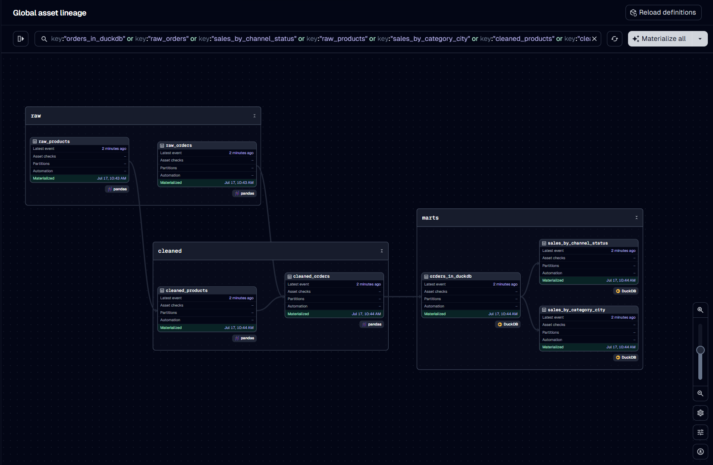
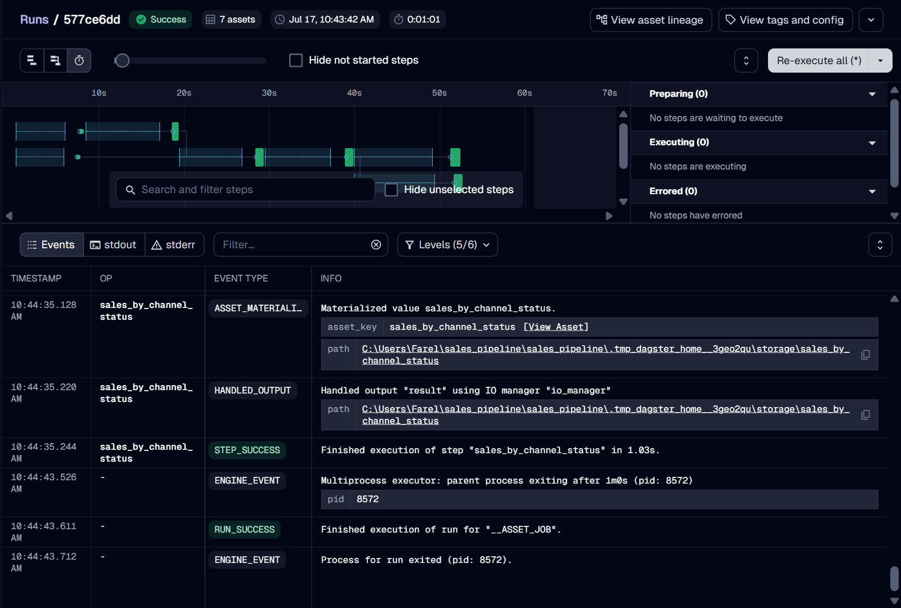
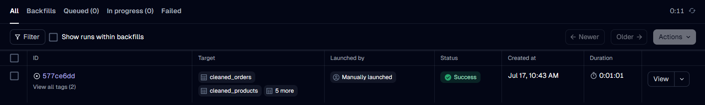
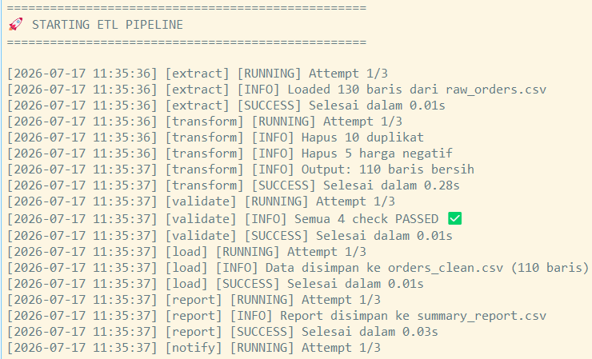
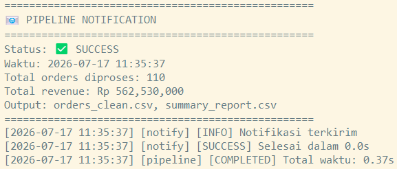
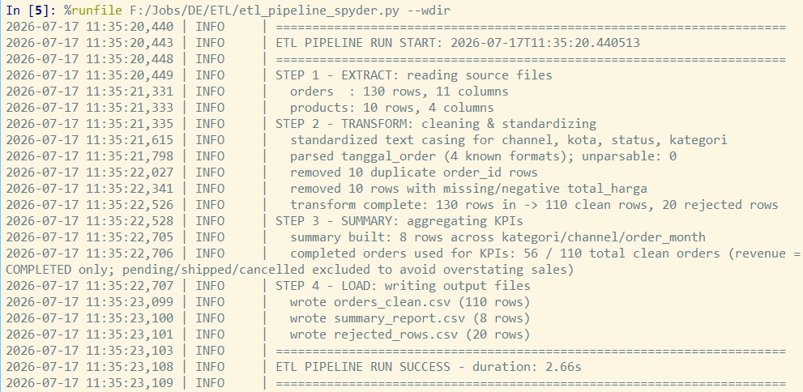
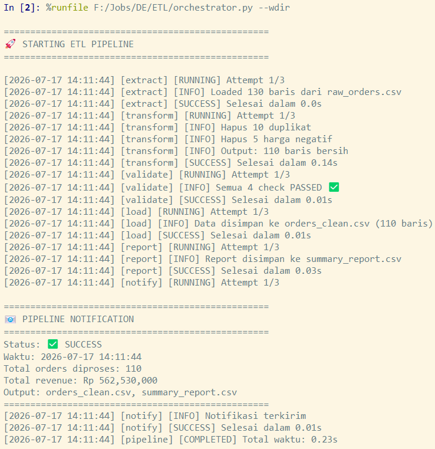

# End-to-End ETL Pipeline: E-Commerce Orders

An end-to-end ETL (Extract, Transform, Load) pipeline for e-commerce order data, built with multiple execution paths — Dagster orchestration, a standalone Python orchestrator script, a Jupyter notebook, and a Spyder-run script — with CLI notifications on completion.

## Table of Contents

1. [Overview](#1-overview)
2. [Tech Stack](#2-tech-stack)
3. [Project Structure](#3-project-structure)
4. [Data Flow](#4-data-flow)
5. [Pipeline Stages](#5-pipeline-stages)
6. [Execution Methods](#6-execution-methods)
7. [Getting Started](#7-getting-started)
8. [Monitoring & Notifications](#8-monitoring--notifications)
9. [Future Improvements](#9-future-improvements)
10. [Screenshots](#10-screenshots)

## 1. Overview

This project demonstrates a complete ETL pipeline for e-commerce order data. Raw order data is extracted, cleaned and transformed into analysis-ready datasets, and loaded into a destination for downstream reporting. The pipeline can be run and monitored in several ways: through Dagster's asset-based orchestration UI, a standalone orchestrator script, a notebook environment, or directly in Spyder — with a CLI notification summary on completion.

## 2. Tech Stack

- **Orchestration:** Dagster
- **Scripting / Orchestrator:** Python (`orchestrator.py`)
- **Development / Prototyping:** Jupyter Notebook, Spyder
- **Language:** Python

## 3. Project Structure

```
End-to-End-ETL-Pipeline_E-Commerce-Orders/
├── data/
├── screenshot/
│   ├── dagster_assets_list.png
│   ├── dagster_asset_lineage.png
│   ├── dagster_run_success.png
│   ├── dagster_runs_list.png
│   ├── dagster_code_location.png
│   ├── orchestrator_full_run.png
│   ├── orchestrator_full_terminal.png
│   ├── notebook_pipeline_start.png
│   ├── cli_notification_summary.png
│   └── spyder_full_log.png
├── src/
├── README.md
├── dagster_project
├── docs
├── notebooks
└── tests
```

## 4. Data Flow

Raw e-commerce order data → Extraction → Transformation/Cleaning → Load → Reporting-ready output. Each stage is represented as a Dagster asset, with dependencies visible in the global asset lineage graph.

## 5. Pipeline Stages

- **Extract:** Pull raw e-commerce order data from source.
- **Transform:** Clean, validate, and reshape the data.
- **Load:** Write processed data to the destination store.
- **Notify:** Emit a CLI summary once the run completes.

## 6. Execution Methods

This pipeline can be run through any of the following:

- **Dagster UI:** Materialize assets and monitor runs interactively.
- **`orchestrator.py`:** Run the full pipeline end-to-end from the command line.
- **Notebook:** Step through each stage interactively for development/debugging.
- **Spyder (`etl_pipeline_spyder.py`):** Run and inspect the pipeline in the Spyder IDE.

## 7. Getting Started

1. Clone the repository
   ```bash
   git clone https://github.com/<your-username>/End-to-End-ETL-Pipeline_E-Commerce-Orders.git
   cd End-to-End-ETL-Pipeline_E-Commerce-Orders
   ```
2. Install dependencies
   ```bash
   pip install -r requirements.txt
   ```
3. Launch the Dagster UI
   ```bash
   dagster dev
   ```
   Then navigate to `http://localhost:3000` to view assets and trigger runs.

   Or run the orchestrator directly:
   ```bash
   python pipeline/orchestrator.py
   ```

## 8. Monitoring & Notifications

Pipeline runs can be monitored through the Dagster UI (assets, lineage, and run history), or via the CLI, which prints a stage-by-stage log and a final notification summary once the pipeline completes.

## 9. Future Improvements

- Add automated data quality checks
- Integrate with a cloud data warehouse (e.g., BigQuery, Snowflake)
- Schedule recurring pipeline runs
- Add email/Slack notifications alongside CLI output

## 10. Screenshots

### 1. Assets Grouped by Layer (Dagster UI)


### 2. Global Asset Lineage Graph (Dagster UI)


### 3. Successful Run Detail (Dagster UI)


### 4. Runs List (Dagster UI)


### 5. Code Location Overview (Dagster UI)


### 6. Full Pipeline Log (`orchestrator.py`)


### 7. Pipeline Start / Stage-by-Stage Log (Notebook)


### 8. Final Notification Summary (CLI)


### 9. Spyder Run (`etl_pipeline_spyder.py`)


### 10. Complete Pipeline Execution Log


## Author

**Alifia Chika Intan (Nevie)**
[LinkedIn](https://linkedin.com/in/alifia-chika-intan-880b94202)
